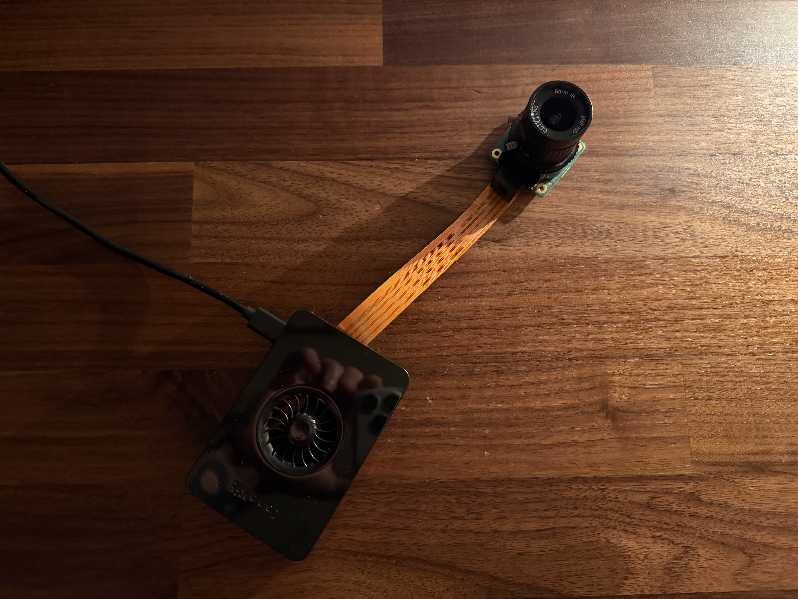
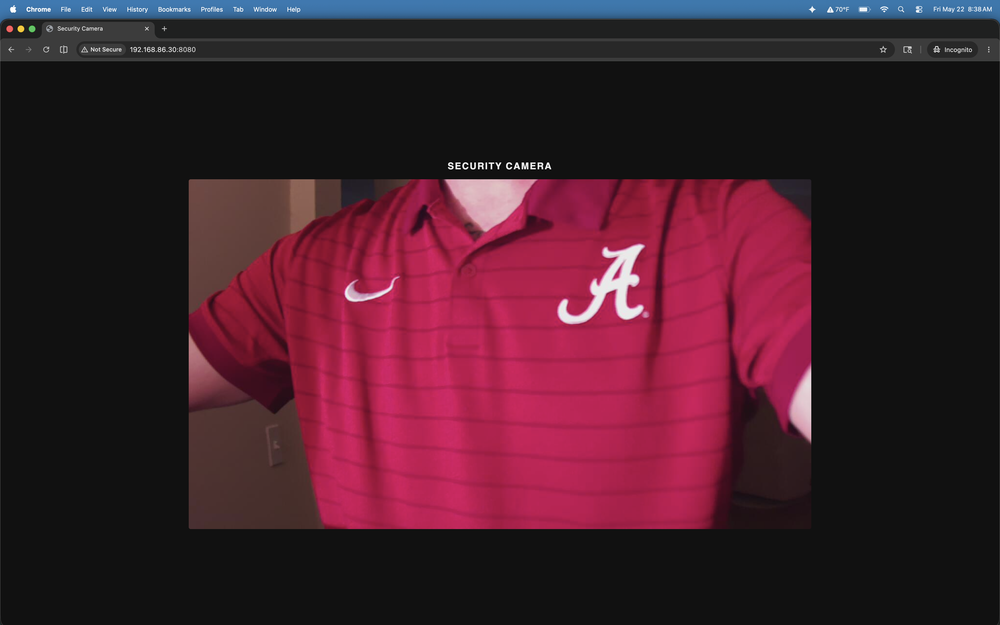

# rpi-security-cam

Live camera streaming on a Raspberry Pi, served over HTTP in Go.

## Demo





## Features

- MJPEG stream via GStreamer + libcamera
- Fan-out hub — multiple viewers share one camera pipeline
- Embedded web viewer
- Docker Compose with device passthrough

## Prerequisites

- [Docker](https://www.docker.com/)
- [Docker Compose](https://docs.docker.com/compose/)
- Raspberry Pi with camera module (libcamera compatible)

## Usage

### Clone Repository

```bash
cd <projects-parent-directory> && git clone https://github.com/pascalallen/rpi-security-cam.git
```

### Bring Up Environment

```bash
docker compose up -d --build
```

You will find the stream viewer running at [http://localhost:8080/](http://localhost:8080/)

### Take Down Environment

```bash
docker compose down
```

## Testing

Run tests and create coverage profile:

```bash
go test ./... -covermode=count -coverprofile=coverage.out
```

Generate HTML file to view test coverage profile:

```bash
go tool cover -html=coverage.out -o coverage.html
```

## Contributing

Pull requests are welcome. For major changes, please open an issue first
to discuss what you would like to change.

Please make sure to update tests as appropriate.

## License

[MIT](LICENSE)
